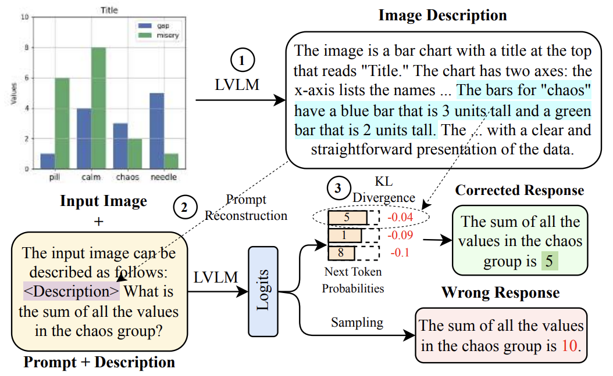
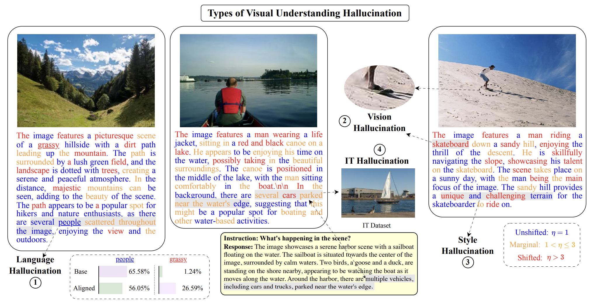
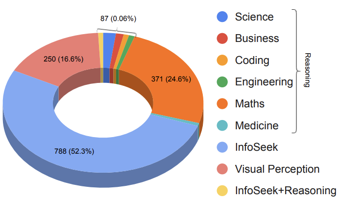

# VDGD
Code for the paper: [VDGD: Mitigating LVLM Hallucinations in Cognitive Prompts by Bridging the Visual Perception Gap](https://arxiv.org/abs/2405.15683)



## Prepare the environment
```
pip install -r requirements.txt
```

## Dataset Setup
All the datasets must be placed in `datasets/`. For dataset format please refer to `datasets/amber.jsonl`.

Link for dataset images: https://drive.google.com/drive/folders/1iPRBrvBwSdF0xEhsonCHsrZ6p0_x3_Bn?usp=share_link

Place the extracted images only into their respective folders, for example: `amber_images -> datasets/AMBER/image`.

## Infering using LVLMs
This section describes the commands and setup required for running inference of multiple LVLMs. LLaVA and MplugOwl2 require specific setup form their repositories, CogVLM and InternLM dependencies are already covered under `requirements.txt`.
```
cd inference_files/
```

LLaVA([Repository Setup](https://github.com/haotian-liu/LLaVA)) -
```
python llava_inference.py <model_path> <dataset_name> <output_file_name> <sampling_flag>

python llava_v1_inference.py <dataset_name> <output_file_name> <sampling_flag>
```

CogVLM -
```
python cogvlm_inference.py <dataset_name> <output_file_name>
```

MplugOwl2([Repository Setup](https://github.com/X-PLUG/mPLUG-Owl/tree/main/mPLUG-Owl2)) -
```
python mlpug_owl2_inference.py <dataset_name> <output_file_name> <sampling_flag>
```

InternLM -
```
python internlm_inference.py <dataset_name> <output_file_name> <sampling_flag>
```

Examples -
```
python llava_inference.py liuhaotian/llava-v1.6-vicuna-7b amber llava_16_amber 0

python llava_v1_inference.py amber llava_v1_amber 0

python cogvlm_inference.py amber cogvlm_amber
```

Supported Arugments:
1. `model_path` - this argument is only for llava inference file where we can pass path to `llava 1.5` or `llava 1.6`.

2. `dataset_name` - file prefix in the `datasets/` folder.

3. `output_file_name` - output file name which will be saved at `inference_generations`.

4. `sampling_flag` - A 1 or 0 value which will set sampling arguments for inference.

## GPT evaluation of LVLM inference
This section describes how to evaluate quality of generation using GPT-4V.
```
cd gpt_evaluations/
python evaluate_gpt.py <inference_file_name>
```

Supported Arugments:
1. `inference_file_name` - file prefix of LVLM output located in `inference_generations`.


## Logit Analysis of LVLMs
This section provides code for token analysis of LVLMs and base LLMs.

Token analysis per dataset entry will be stored at `./AlignTDS/src/demo/docs/{model_generated_dataset_name}_tp_justeval/`.

```
cd AlignTDS/ 
sh run.sh <llm_model_name> <shard_size> <num_gpus> <model_generated_dataset_name> <dataset_length>
```

Example - 
```
sh run.sh llava_1.6 126 8 llava_1.6_amber 1004
```

Supported arguments:
1. `llm_model_name` - llava_v1, llava_1.5, llava_1.6, cogvlm.

2. `shard_size` - dataset_length/num_gpus.

3. `model_generated_dataset_name` - this argument is the name of the file to run logit analysis for in `./AlignTDS/data/`.

## Categorizing Visual Hallucinations



### Setup
This section requires the setup of [LLaMA-Factory
](https://github.com/hiyouga/LLaMA-Factory) and [meta-llama/Meta-Llama-3-8B](https://huggingface.co/meta-llama/Meta-Llama-3-8B). 

We will use a prompt to identify all the visual elements:
```
I will provide you with a response from an AI agent which has been asked to describe an image. Please identify all the phrases that in the image description that constitute the image. These phrases might be foreground and background objects, adverbial phrases, etc. Return them as comma separated values. There should not be any additional information other than these values in the output. The response is as follows: {response}.
```

`response` - Output generated by LVLM.

Example output of `LLaMA-Factory`:
```
{"predict": "three individuals, a meadow, a park, wildflowers"}
{"predict": "canoe, calm waters, sky"}
{"predict": "young child, gray pants, grass, yellow flowers"}
```

### Algorithm Execution 
```
cd hallucination_categorization/
```

For MMMU Openended generation:
```
python gpt_categorize_hallucinations_mmmu.py <model_generated_dataset_name> <object_file_path> <gpt_eval_file_name>
```
For Amber generation:
```
python gpt_categorize_hallucinations_amber.py <model_generated_dataset_name> <object_file_path> <gpt_eval_file_name>
```

Supported arguments:
1. `model_generated_dataset_name` - this is the same argument used in Logit Analysis section above.

2. `object_file_path` - generated file from `LLaMA-Factory`.

3. `gpt_eval_file_name` - this is the same argument as <inference_file_name> in GPT Evaluation section.

## VDGD Inference
This section details the execution of `VDGD` algorithm for LVLM inference.

```
cd ./LLaVA-Align/experiments/eval/sampling/
```
 
For generating description logits:
```
python generate_desc_logits.py \
--model_path liuhaotian/llava-v1.5-7b \
--amateur_model_path meta-llama/Llama-2-7b-chat-hf \
--question_file vallu_benchmark.jsonl \
--answers_file out.jsonl \
--use_dd
```

Supported arguments:

1. `model_path` - Path to the LVLM model.
2. `amateur_model_path` - Path to the base LLM.
3. `question_file` - Path to the inference dataset.
4. `answers_file` - Path to the output inference generation.
5. `use_dd` - Flag to use debiased decoding.

Logits are stored at `./LLaVA-Align/experiments/eval/sampling/description_logits/logits_{question_file}.pkl`

For VDGD Inference:
```
python vdgd.py \
--model_path liuhaotian/llava-v1.5-7b \
--question_file vallu_benchmark.jsonl \
--answers_file output.jsonl \
--logits_file description_logits/logits_vallu_benchmark.pkl \
--decoding_type "vdgd" \
--kl_reduction "avg"
```

Supported Arguments:

1. `model_path` - Path to the LVLM model.
2. `question_file` - Path to the inference dataset.
3. `answers_file` - Path to the output inference generation.
4. `desc_file` - Path to the description file generated above.
5. `logits_file` - Path to the description logits file.
6. `decoding_type` - Type of decoding to use, example: `vdgd`, `gd`(greedy) and `sd` (sampling).
7. `kl_reduction` - KL Divergence reduction use `avg`, `sum` or `min`.

## VaLLu Benchmark


Please download the dataset from [here](https://drive.google.com/file/d/1QPISJ_2qszTeopQEnR3jmA31n4qTlYsG/view).

## 🌻 Acknowledgement  
We use the code from the following repositories: [LLaVA](https://github.com/haotian-liu/LLaVA), [MplugOwl2](https://github.com/X-PLUG/mPLUG-Owl/tree/main/mPLUG-Owl2), [AlignTDS](https://github.com/Re-Align/AlignTDS), [LLaMA-Factory
](https://github.com/hiyouga/LLaMA-Factory) and [LLaVA-Align](https://github.com/yfzhang114/LLaVA-Align).

Please cite the above repositories if you find their code useful.

## 🔏 Citation    
```
@misc{ghosh2024vdgdmitigatinglvlmhallucinations,
      title={VDGD: Mitigating LVLM Hallucinations in Cognitive Prompts by Bridging the Visual Perception Gap}, 
      author={Sreyan Ghosh and Chandra Kiran Reddy Evuru and Sonal Kumar and Utkarsh Tyagi and Oriol Nieto and Zeyu Jin and Dinesh Manocha},
      year={2024},
      eprint={2405.15683},
      archivePrefix={arXiv},
      primaryClass={cs.CV},
      url={https://arxiv.org/abs/2405.15683}, 
}
```
